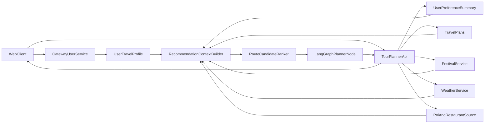

# Personalized Travel Recommendation Architecture

## 목적
`tourplaner`가 단순한 지역 기반 추천을 넘어서 사용자별 선호, 여행 이력, 행사, 날씨, 맛집 성향을 함께 반영한 개인화 여행 추천을 만들기 위한 데이터 구조와 시스템 경계를 정리한다.

이 문서는 다음 코드 구조를 기준으로 작성했다.

- Gateway 사용자 계정 기준점: `D:\develop\tourstar\api.tourstory.site\gateway\src\main\java\site\aiion\api\services\user\User.java`
- Gateway 사용자 DTO/서비스: `D:\develop\tourstar\api.tourstory.site\gateway\src\main\java\site\aiion\api\services\user\UserModel.java`, `D:\develop\tourstar\api.tourstory.site\gateway\src\main\java\site\aiion\api\services\user\UserServiceImpl.java`
- JWT 기준 사용자 식별: `D:\develop\tourstar\api.tourstory.site\gateway\src\main\java\site\aiion\api\services\oauth\util\JwtTokenProvider.java`
- 여행 이력 저장: `D:\develop\tourstar\sevices.tourstory.site\tourplaner\app\models\travel_plan.py`
- 플래너 API: `D:\develop\tourstar\sevices.tourstory.site\tourplaner\app\api\v1\routes_planner.py`
- 행사 원천 데이터: `D:\develop\tourstar\sevices.tourstory.site\festival\app\services\festival_client.py`

## 현재 상태

### Gateway `users`
현재 `users`는 인증 계정 중심이다.

- `id`
- `name`
- `email`
- `nickname`
- `provider`
- `providerId`
- `refreshToken`
- `honor`

즉, 현재 `User` 엔티티는 "누구인가"를 저장하는 데 최적화되어 있고, "어떤 여행을 좋아하는가"를 저장하는 구조는 아니다.

### Planner
현재 planner가 이미 보유한 신호는 아래와 같다.

- 사용자가 선택한 여행 지역
- 사용자가 입력한 여행 시작일/종료일
- 저장된 여행 플랜 이력
- 수정된 일정 프롬프트 이력의 잠재 신호
- 행사 데이터
- 날씨 데이터 연동 여지

하지만 아직 이 신호들이 통합된 개인화 프로필로 정리되어 있지 않다.

## 핵심 원칙

### 1. `users`는 최소 확장
`users`는 인증, 식별, 공통 프로필 수준만 유지한다.

### 2. 여행 선호는 별도 테이블로 분리
명시적 선호는 `user_travel_profile`로 분리한다.

### 3. 행동 기반 파생 신호는 또 분리
저장 플랜, 수정 프롬프트, 반복 지역, 평균 여행 길이 같은 값은 `user_preference_summary` 같은 파생 테이블로 분리한다.

### 4. 추천 컨텍스트는 planner에서 조립
Gateway는 계정/프로필의 원천이고, 최종 추천 컨텍스트 조립은 `tourplaner`에서 수행한다.

## 최초에 Gather 해야 할 정보

### A. 명시적 사용자 프로필
회원 가입 직후 또는 온보딩에서 1회 수집하는 정보다.

| 항목 | 설명 | 추천 활용 |
|---|---|---|
| `locale` | `ko-KR`, `en-US` 등 | 응답 언어, 지역명 표기 |
| `residenceRegion` | 거주 권역/시도 | 근거리 여행, 출발권역 추정 |
| `ageBand` | `20s`, `30s`, `40s_plus` 등 | 과도한 세분화 없이 성향 보정 |
| `defaultCompanionType` | `solo`, `couple`, `friends`, `family_with_kids`, `parents` | 장소/맛집/동선 톤 결정 |
| `defaultBudgetBand` | `budget`, `mid`, `premium` | 식당/카페/체험 가격대 |
| `defaultTransportMode` | `public_transport`, `car`, `taxi_mix`, `walk_heavy` | 이동 동선 최적화 |
| `travelPace` | `relaxed`, `balanced`, `dense` | 하루 일정 개수 |
| `walkingTolerance` | 낮음, 보통, 높음 | 도보 많은 코스 회피/선호 |
| `preferredActivityTags` | 역사, 자연, 미식, 카페, 쇼핑, 힐링, 액티비티, 야경, 축제 | 루트 생성 priors |
| `dislikedActivityTags` | 혼잡, 장거리 도보, 실외 장시간 등 | 제외 조건 |
| `foodPreferenceTags` | 로컬맛집, 카페, 해산물, 디저트 등 | 식당 추천 |
| `foodRestrictionTags` | 채식, 알레르기, 매운맛 민감도 등 | 식당 필터 |
| `accessibilityNeeds` | 유모차, 휠체어, 고령자 동행 등 | 접근성 필터 |
| `preferredTripLength` | 1박2일, 2박3일 등 | 기본 루트 길이 priors |

### B. 여행 요청 시점 컨텍스트
루트 생성 요청마다 수집하는 정보다.

- `location`
- `startDate`
- `endDate`
- `partySize`
- `tripPurpose`
- `mustVisitList`
- `avoidList`
- `lodgingArea`
- `thisTripCompanionType`
- `thisTripBudgetBand`
- `thisTripTransportMode`

이 정보는 고정 프로필보다 우선한다. 예를 들어 평소엔 혼행을 좋아해도 이번 여행이 가족 여행이면 이번 요청값을 우선 사용해야 한다.

### C. 행동 기반 암묵적 신호
사용자 입력 없이 시스템이 축적하는 정보다.

- 저장한 플랜의 지역 분포
- 저장한 플랜의 테마 분포
- 평균 여행 일수
- 오전/야간 일정 비율
- 자주 등장하는 POI 유형
- 수정 프롬프트 키워드
- 반복적으로 제거되는 일정 유형
- 반복 저장하는 지역
- 최근 관심 지역

예시:

- `"궁궐 대신 카페"` -> 역사 선호 하향, 카페 선호 상향
- `"덜 걷고 싶어"` -> walkingTolerance 하향
- `"야시장 넣어줘"` -> nightlife/festival affinity 상향

### D. 외부 컨텍스트 신호

- 행사 겹침 여부
- 행사 성격: 전통문화, 공연, 야시장, 가족형, 야간형
- 날짜별 날씨
- 주말/공휴일
- 성수기/비성수기
- 운영시간/휴무일
- 혼잡도 대체 후보

## `user` 도메인에 추가할 칼럼

## 1. `users`에 직접 추가해도 되는 칼럼
아래 필드는 계정/공통 프로필에 가까워 `users`에 있어도 괜찮다.

| 칼럼 | 타입 예시 | 이유 |
|---|---|---|
| `profile_image_url` | `varchar(500)` | OAuth 이미지 또는 사용자 프로필 이미지 |
| `locale` | `varchar(20)` | 언어/표시 로케일 |
| `residence_region` | `varchar(100)` | 거주권역 기반 추천 |
| `age_band` | `varchar(30)` | 완만한 성향 보정 |
| `marketing_opt_in` | `boolean` | 행사/추천 알림 동의 |
| `onboarding_completed` | `boolean` | 여행 선호 수집 완료 여부 |
| `last_preference_updated_at` | `timestamp` | 최신성 확인 |

이 정도까지가 `User`에 넣기 적절한 상한선이다.

## 2. `user_travel_profile`로 분리해야 하는 칼럼
이 테이블은 사용자가 직접 선택/수정하는 "명시적 선호"의 원본이다.

### 권장 스키마

| 칼럼 | 타입 예시 | 설명 |
|---|---|---|
| `user_id` | `bigint` | `users.id` FK |
| `default_companion_type` | `varchar(40)` | 기본 동행 유형 |
| `default_budget_band` | `varchar(20)` | 기본 예산대 |
| `default_transport_mode` | `varchar(30)` | 기본 교통수단 |
| `travel_pace` | `varchar(20)` | 일정 밀도 |
| `walking_tolerance` | `varchar(20)` | 도보 허용도 |
| `preferred_trip_length` | `varchar(20)` | 선호 여행 길이 |
| `preferred_activity_tags` | `json` | 선호 활동 태그 배열 |
| `disliked_activity_tags` | `json` | 비선호 활동 태그 배열 |
| `food_preference_tags` | `json` | 음식 취향 태그 배열 |
| `food_restriction_tags` | `json` | 음식 제한 태그 배열 |
| `accessibility_needs` | `json` | 접근성 요구 태그 배열 |
| `must_avoid_tags` | `json` | 명시적 회피 조건 |
| `preferred_regions` | `json` | 선호 지역 배열 |
| `avoided_regions` | `json` | 회피 지역 배열 |
| `festival_preference_level` | `smallint` | 축제 선호도 1~5 |
| `nightlife_preference_level` | `smallint` | 야간 활동 선호도 |
| `shopping_preference_level` | `smallint` | 쇼핑 선호도 |
| `history_preference_level` | `smallint` | 역사/문화 선호도 |
| `nature_preference_level` | `smallint` | 자연 선호도 |
| `healing_preference_level` | `smallint` | 휴식/힐링 선호도 |
| `activity_preference_level` | `smallint` | 체험/액티비티 선호도 |
| `created_at` | `timestamp` | 생성 시각 |
| `updated_at` | `timestamp` | 수정 시각 |

## 3. `user_preference_summary`로 분리해야 하는 칼럼
이 테이블은 시스템이 자동으로 계산하는 추천용 피처 집계본이다.

### 권장 스키마

| 칼럼 | 타입 예시 | 설명 |
|---|---|---|
| `user_id` | `bigint` | 사용자 식별자 |
| `favorite_themes` | `json` | 상위 선호 테마 |
| `favorite_locations` | `json` | 반복 저장 지역 |
| `avg_trip_days` | `numeric(4,2)` | 평균 여행 길이 |
| `morning_activity_ratio` | `numeric(5,2)` | 오전형 성향 |
| `night_activity_ratio` | `numeric(5,2)` | 야간형 성향 |
| `indoor_preference_score` | `numeric(5,2)` | 실내 선호도 |
| `outdoor_preference_score` | `numeric(5,2)` | 실외 선호도 |
| `festival_affinity_score` | `numeric(5,2)` | 축제 affinity |
| `foodie_affinity_score` | `numeric(5,2)` | 맛집 affinity |
| `edit_instruction_keywords` | `json` | 수정 프롬프트 핵심 키워드 |
| `recent_locations` | `json` | 최근 관심 지역 |
| `last_trip_at` | `timestamp` | 최근 저장 플랜 시각 |
| `last_analyzed_at` | `timestamp` | 마지막 요약 계산 시각 |

## 왜 이 3계층으로 나누는가

### `users`
- 로그인/식별/리프레시 토큰 검증의 기준
- JWT subject와 직접 연결
- 너무 자주 바뀌는 추천용 값이 들어가면 역할이 흐려짐

### `user_travel_profile`
- 사용자가 직접 고친 값
- UI 폼과 1:1로 대응
- 선호 변경 이력 관리가 쉬움

### `user_preference_summary`
- 저장 플랜과 수정 프롬프트에서 계산되는 파생값
- 재계산 가능
- 모델/룰 변경 시 다시 생성 가능

## 현재 구조에서의 책임 분리

### Gateway `user`
책임:

- 인증 계정
- 사용자 기본 프로필
- 온보딩 선호 입력
- 프로필 조회/수정

비책임:

- 저장 플랜 분석
- 행사/날씨 결합 추천
- LLM 프롬프트 조립

### `tourplaner`
책임:

- 여행 요청 컨텍스트 수집
- 저장 플랜 이력 조회
- 일정 수정 프롬프트 반영
- 행사/날씨/맛집 신호 결합
- 최종 추천 컨텍스트 생성
- LangGraph/LLM 실행

### `festival`
책임:

- 행사 원천 데이터 수집 및 캐시
- 날짜/지역 기반 행사 후보 공급

### `weather`
책임:

- 여행 기간 날씨 기반 실내/실외 보정

## 추천 컨텍스트 빌더 아키텍처



## 추천 데이터 흐름

### 1. 로그인 후 프로필 확인
Gateway는 JWT subject 기준으로 사용자를 식별한다. 현재 `JwtTokenProvider`는 access token의 subject에 앱 사용자 ID를 넣는다.

즉 개인화의 기본 키는 `providerId`가 아니라 `users.id`여야 한다.

### 2. 여행 요청 수신
planner는 아래 값을 받는다.

- `location`
- `startDate`
- `endDate`
- 요청 시점 동행/예산/교통수단 보정값

### 3. 추천 컨텍스트 로드
planner는 다음 데이터를 조합한다.

- Gateway의 `users`
- Gateway의 `user_travel_profile`
- planner의 `travel_plans`
- planner가 계산한 `user_preference_summary`
- festival 서비스의 날짜 겹침 행사
- weather 서비스의 여행 기간 예보
- 맛집/POI 소스

### 4. ContextBuilder 조립
`RecommendationContextBuilder`는 아래 형태의 내부 컨텍스트를 만든다.

```json
{
  "user_profile": {
    "companion_type": "couple",
    "budget_band": "mid",
    "travel_pace": "balanced",
    "walking_tolerance": "low"
  },
  "behavior_summary": {
    "favorite_themes": ["미식", "야경"],
    "favorite_locations": ["부산", "여수"],
    "festival_affinity_score": 0.72
  },
  "trip_request": {
    "location": "busan",
    "start_date": "2026-03-04",
    "end_date": "2026-03-06"
  },
  "external_context": {
    "festivals": [],
    "weather": [],
    "restaurants": []
  }
}
```

### 5. 후보 루트 생성과 점수화
LLM에 바로 한 번에 던지기보다, 먼저 후보 루트를 만들고 점수화하는 2단계가 안정적이다.

#### 단계 1
- 지역, 날짜, 선호 태그 기준으로 후보 루트 5~10개 생성

#### 단계 2
- 각 루트를 아래 기준으로 재정렬
  - 사용자 선호 일치도
  - 행사 겹침 적합도
  - 날씨 적합도
  - 이동 부담도
  - 예산 적합도
  - 동행 유형 적합도

#### 단계 3
- 상위 루트에 대해 날짜별 일정 생성

## 행사, 맛집, 성격 정보를 어떻게 결합할 것인가

## 행사
행사는 "있으면 추가"가 아니라 일정 성격을 바꾸는 강한 신호다.

예시:

- 전통문화 행사 -> 역사/문화 선호 사용자에게 가중치
- 야시장/야간 행사 -> 야경/커플/친구 여행에 가중치
- 가족형 행사 -> 아이 동반 여행에 가중치

필요한 정규화 필드:

- `event_type`
- `audience_fit`
- `day_or_night`
- `start_date`
- `end_date`
- `lat`
- `lng`
- `locality_score`

## 맛집
맛집은 단순 평점보다 여행 맥락 적합성이 중요하다.

권장 정규화 필드:

- `cuisine_type`
- `price_band`
- `meal_slot`
- `wait_tolerance`
- `group_fit`
- `kid_friendly`
- `senior_friendly`
- `parking_available`
- `locality_score`
- `signature_menu`

예시 매핑:

- `family_with_kids` -> 키즈 친화, 대기 짧음, 좌석 여유 우선
- `parents` -> 소음 낮고 도보 부담 적은 식당 우선
- `couple` -> 분위기, 야경 연계, 디저트/카페 결합 강화
- `solo` -> 접근성, 회전율, 혼밥 적합도 강화

## 현재 코드 기준 제약사항

### 1. JWT 기준 사용자는 `users.id`
`JwtTokenProvider`는 subject에 앱 사용자 ID를 넣는다. 따라서 개인화 조인은 `users.id`를 기준으로 해야 한다.

### 2. refresh 시 추가 클레임이 다시 채워지지 않는다
현재 `AuthController` refresh는 `app_user_id` 위주로 새 access token을 재생성한다. 따라서 프로필 관련 클레임을 access token에 많이 넣는 방식은 유지성이 낮다.

권장:

- access token에는 최소 정보만 유지
- 프로필은 API 조회로 보완

### 3. planner 저장 이력은 이미 존재
`travel_plans`는 현재도 `user_id`, `location`, `route_name`, `start_date`, `end_date`, `schedule`를 가지고 있어 개인화의 가장 좋은 1차 데이터 소스다.

### 4. 행사 데이터는 이미 활용 가능
`festival_client.py`는 `fstvlNm`, `opar`, `fstvlStartDate`, `fstvlEndDate` 등 개인화 추천에 바로 쓸 수 있는 필드를 이미 갖고 있다.

## MVP 우선순위

### 1단계: 바로 넣을 값

#### `users`
- `profile_image_url`
- `locale`
- `residence_region`
- `onboarding_completed`
- `last_preference_updated_at`

#### `user_travel_profile`
- `default_companion_type`
- `default_budget_band`
- `default_transport_mode`
- `travel_pace`
- `walking_tolerance`
- `preferred_activity_tags`
- `food_preference_tags`
- `festival_preference_level`
- `accessibility_needs`

#### `user_preference_summary`
- `favorite_themes`
- `favorite_locations`
- `avg_trip_days`
- `edit_instruction_keywords`

### 2단계: 고도화
- 날씨 기반 실내/실외 보정
- 행사 affinity score
- 시간대 선호 점수
- 지역 재방문 선호도
- 숙소 중심 동선 최적화
- 맛집/POI ranking 고도화

## 최종 권장안

- `users`에는 계정 + 최소 프로필만 넣는다.
- 명시적 여행 선호는 `user_travel_profile`로 분리한다.
- 저장 플랜/수정 이력 기반 파생 피처는 `user_preference_summary`로 분리한다.
- planner는 이 세 레이어와 행사/날씨/맛집 소스를 조합해 `RecommendationContextBuilder`를 만든다.
- LangGraph는 이 컨텍스트를 받아 `후보 루트 생성 -> 점수화 -> 날짜별 일정 생성` 순으로 동작한다.

이 구조가 현재 코드베이스를 가장 덜 흔들면서도 개인화 품질을 가장 안정적으로 높일 수 있는 방향이다.
