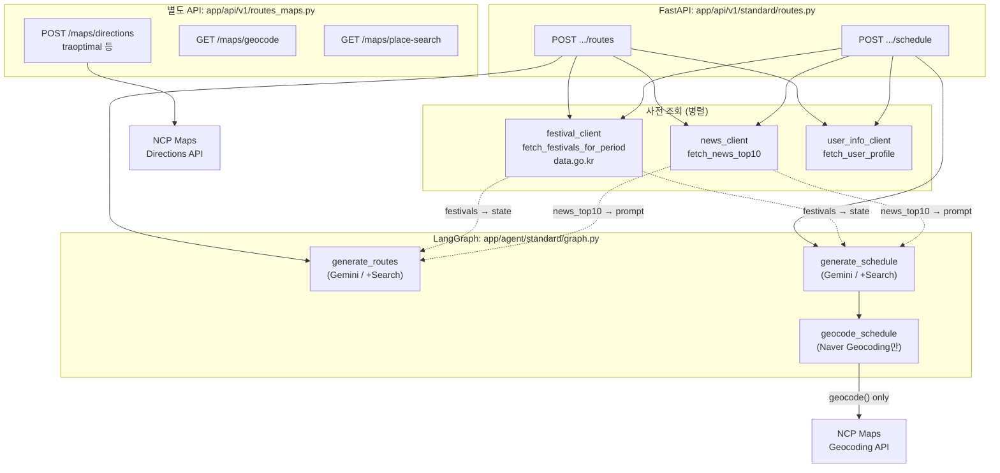

# Planner 서비스: 루트·일정 생성 시 데이터 소스 (체크 결과)

> 범위: `backend/planer.kroaddy.site` — **Standard 플래너** (`/api/v1/planner/...`) 기준.  
> K-콘텐츠 에이전트(`app/agent/k_content/`)는 DB 앵커 + Gemini(Search) 중심이며, 축제·일정 파이프라인은 Standard와 별도 그래프다.

---

## 1. 요약 (질문에 대한 짧은 답)

| 항목 | 반영 여부 | 비고 |
|------|-----------|------|
| **전국 축제 정보** | **예** | 다만 출처는 **네이버 API가 아니라 공공데이터포털(data.go.kr) 전국문화축제표준데이터**다. |
| **네이버 API** | **부분** | **일정 생성 직후 좌표 보강(Geocoding)**에 사용. 루트/일정 **문장 생성 프롬프트**에는 축제·최적경로용 네이버 데이터가 들어가지 않는다. |
| **네이버 최적 경로(Directions, traoptimal)** | **에이전트 그래프 밖** | `get_directions`는 구현·HTTP API로만 제공되며, **LangGraph 루트/일정 노드에서는 호출되지 않는다.** |

---

## 2. 아키텍처 개요 (Standard 플래너)

---

## 3. Gemini(에이전트) 역할

- **모델**: `app/agent/standard/nodes.py`에서 `gemini-3-flash-preview` 사용.
- **옵션 `use_search`**: Google Search **grounding** 바인딩 — 모델이 웹 검색으로 실시간 정보를 보강할 수 있음(별도 파이프라인이 아닌 도구).
- **폴백**: 쿼터 등에 따라 OpenAI `gpt-5-mini` 등으로 대체 가능(동일 파일 내 로직).

**루트 추천** (`generate_routes`): 프롬프트에 지역명, 기간, **축제 블록(최대 5건)**, 뉴스 Top10, 유저 프로필, 기존 루트 제외 목록 등이 포함됨.

**일정 생성** (`generate_schedule`): 선택 루트명, 날짜 매핑, **축제 블록**, 뉴스, 비용·주소·lat/lng 규칙 등으로 JSON 일정 생성.

---

## 4. 전국 축제 정보 — 어디서 오는가

- **구현**: `app/services/festival_client.py`
- **원천 API**: `http://api.data.go.kr/openapi/tn_pubr_public_cltur_fstvl_api` (전국문화축제표준데이터, JSON)
- **인증**: `DATA_GO_KR_SERVICE_KEY` (`app/core/config.py`)
- **연결 지점**: `app/api/v1/standard/routes.py`에서 `get_routes` / `get_schedule` 호출 전에 `fetch_festivals_for_period(...)` 실행 후 `state["festivals"]`에 주입.
- **LLM 반영**: `app/agent/standard/nodes.py`의 `generate_routes`, `generate_schedule`에서 행사 목록을 텍스트 블록으로 붙여, **첫 번째 테마(행사 중심) 및 일정 슬롯**에 반영하도록 지시.

**중요**: 축제 데이터는 **네이버 Open API가 아니다**. 설정에 `festival_service_url`이 있으나, 현재 축제 클라이언트 주석상 **별도 festival 마이크로서비스 없이 planer 내부에서 data.go.kr 직접 호출** 구조로 기술되어 있다.

---

## 5. 네이버 API — 무엇에 쓰이는가

### 5.1 플래너 에이전트 그래프 안

- **`app/services/naver_map_client.geocode`** 만 **`geocode_schedule`** 노드에서 사용 (`app/agent/standard/nodes.py`).
- 흐름: `generate_schedule` → `geocode_schedule` → END (`app/agent/standard/graph.py`).
- 목적: 각 일정 항목의 **주소 우선, 실패 시 장소명**으로 Geocoding하여 `lat`/`lng`/주소 정합성 보강. 실패 시 모델이 준 좌표 유지.

### 5.2 에이전트 그래프 밖 (클라이언트·기타용 HTTP)

- **`app/api/v1/routes_maps.py`**
  - Geocoding 프록시
  - **지역 검색** (`keyword_search` — `openapi.naver.com/v1/search/local.json`, 별도 Client Id/Secret)
  - Static Map
  - **Directions** (`get_directions`) — `traoptimal` 옵션으로 경로 요약·폴리라인 반환

이 **Directions·지역검색**은 Standard LangGraph **루트/일정 생성 파이프라인에 연결되어 있지 않다** (코드 상 `get_directions` 호출은 `routes_maps.py`에서만 확인됨).

---

## 6. “최적 루트” 관점 정리

- 네이버 Directions 클라이언트는 **`option: traoptimal`**(및 `trafast` 등 폴백)로 **도로 기준 경로**를 반환한다 (`naver_map_client.py`).
- 그러나 **일정의 방문 순서·동선 최적화**는 해당 API 결과를 읽어 재정렬하는 단계가 **Standard 플래너 그래프에 없다**.
- 순서와 구성은 **Gemini( + 선택적 Search grounding) + 프롬프트 규칙 + 축제/뉴스 컨텍스트**에 의해 결정된다.

---

## 7. 그 외 인접 데이터 소스 (참고)

| 소스 | 용도 |
|------|------|
| `news_client` | 뉴스 Top10 → 루트/일정 프롬프트 |
| `user_info_client` | 국적 등 프로필 → 언어·개인화 |
| `search_client` + KOBIS | 영화 관련 **수정/리롤** 등 특정 흐름에서 박스오피스 컨텍스트 주입 |

---

## 8. 결론

- **전국 축제**: **반영됨** — **data.go.kr 표준 축제 API** → API 레이어에서 조회 → Gemini 프롬프트에 주입.  
- **네이버 API**: **좌표 보강(Geocoding) 및 지도/경로용 별도 REST**로 쓰임. **축제 원천 데이터는 네이버가 아님.**  
- **네이버 최적 경로(traoptimal)**: **구현·노출은 되어 있으나, 루트/일정 AI 에이전트가 그 결과로 일정을 다시 짜거나 검증하는 구조는 아님.**

문서 작성 시점 기준으로 위 내용은 저장소 내 파일 구조·호출 관계를 따른다.
