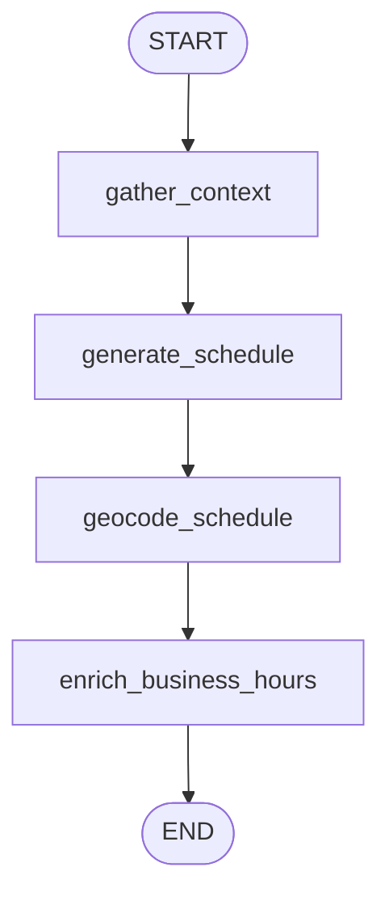
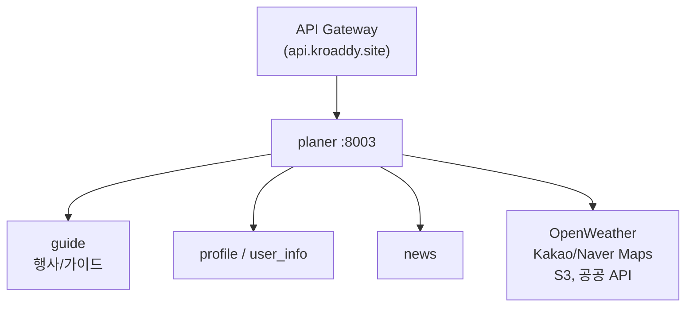

# planer.kroaddy.site — 아키텍처

Tour Planner(플래너) 서비스의 **구성 요소·데이터 흐름·외부 연동**을 한 문서로 정리합니다. 경로는 **이 저장소 루트**(`planer.kroaddy.site/`) 기준입니다.

---

## 1. 한 줄 요약

**FastAPI**가 HTTP·캐시·SSE를 담당하고, **LangGraph**가 `app/agent/standard/` 아래 그래프로 **여행 루트·일정**을 생성합니다. 컨텍스트 수집(프로필·행사·뉴스·날씨·웹·카카오 POI) → 일정 LLM → 지오코딩 → (옵션) 영업시간 보강까지 **상태 `PlannerState`**로 이어집니다.

---

## 2. 기술 스택

| 구분 | 선택 |
|------|------|
| 런타임 | Python 3.11 |
| API | FastAPI, Uvicorn |
| 에이전트 | LangGraph, LangChain Core |
| LLM | Google Gemini (`langchain-google-genai`), OpenAI (`langchain-openai`) 폴백 |
| DB | SQLAlchemy asyncio, asyncpg / psycopg2, Alembic |
| 객체 스토리지 | AWS S3 (boto3, presigned URL) |
| 이미지 안전 | NudeNet, ONNX Runtime, Pillow |
| 브라우저 자동화 | Playwright + Chromium (영업시간 등) |
| HTTP 클라이언트 | httpx (Kakao, Naver, 뉴스, 날씨, user_info, Upstash REST) |

---

## 3. 디렉터리 구조 (요약)

```
app/
  main.py                 # FastAPI 앱, lifespan, CORS, v1_router 마운트
  core/config.py          # pydantic-settings, 환경변수
  api/v1/
    __init__.py           # v1_router = standard + k_content + user_content + weather + maps
    standard/routes.py    # /api/v1/planner — 루트·일정·캐시·SSE
    k_content/routes.py   # /api/v1/k-content
    user_content/routes.py
    routes_weather.py
    routes_maps.py
  agent/standard/
    graph.py              # routes_graph, build_schedule_graph, schedule_graph
    graph_checkpoint.py   # LangGraph Redis 체크포인트 init/close
    state.py              # PlannerState (TypedDict)
    nodes_routes.py       # generate_routes
    nodes_schedule.py     # gather_context, generate_schedule, geocode, 영업시간
    nodes_common.py       # Gemini 공통, modify / reroll 등
  services/               # 외부·내부 HTTP, Upstash, festival, news 등
```

---

## 4. 진입점과 생명주기

| 단계 | 내용 |
|------|------|
| 기동 | `app/main.py` → `lifespan` → `init_schedule_graph_checkpoint()` |
| Redis 체크포인트 | `LANGGRAPH_REDIS_URL` 등이 유효하면 `AsyncRedisSaver`로 `schedule_graph`를 **재컴파일**해 교체 |
| 종료 | `close_schedule_graph_checkpoint()` 및 Kakao / Naver / News / Weather / user_info / Upstash **공유 클라이언트 정리** |

HTTP 핸들러는 `from app.agent.standard import graph as std_graph`로 그래프를 참조하므로, lifespan 이후 **`std_graph.schedule_graph`** 가 최신 인스턴스를 가리킵니다.

---

## 5. API 라우팅 (`app/api/v1/__init__.py`)

| 라우터 | Prefix | 역할 |
|--------|--------|------|
| `standard.routes` | `/api/v1/planner` | 슬러그별 루트·일정, L1/L2 캐시, 비스트리밍·SSE 스트림 |
| `k_content.routes` | `/api/v1/k-content` | K-콘텐츠 |
| `user_content.routes` | `/api/v1/user-content` | 업로드, NSFW, S3, 유저 루트 CRUD |
| `routes_weather` | `/api/v1/weather` | 날씨 |
| `routes_maps` | `/api/v1/maps` | 네이버 맵 래핑 |

운영에서는 보통 **api.kroaddy.site** 게이트웨이가 위 경로를 이 서비스(`:8003`)로 역프록시합니다.

---

## 6. LangGraph

### 6.1 루트 그래프 `routes_graph` (`graph.py`)

행사·뉴스·날씨 없이 **단일 노드**로 루트 JSON 생성.


### 6.2 일정 그래프 `schedule_graph` (`build_schedule_graph`)

선형 파이프라인. **다일차 일정은 Day별 순차 LLM**(exclude 누적), **지오코딩은 항목 단위 병렬**.



| 노드 | 파일 | 설명 |
|------|------|------|
| `gather_context` | `nodes_schedule.py` | 프로필·행사·뉴스·날씨 1차 병렬 → 2차: `use_search`면 웹(Google) + 카카오 POI 병렬, 아니면 카카오 POI + 네이버 블로그 팁(검색 API 키·설정 시) 병렬 |
| `generate_schedule` | `nodes_schedule.py` | 날짜 있으면 일차별 순차 생성, `_fix_duplicate_days` 등 |
| `geocode_schedule` | `nodes_schedule.py` | 카카오 1순위·네이버 2순위 등 |
| `enrich_business_hours` | `nodes_schedule.py` | 옵션: 네이버 플레이스 영업시간 |

### 6.3 체크포인트 (선택)

- 환경: `LANGGRAPH_REDIS_URL` (`rediss://...`)
- 동일 `thread_id`로 `ainvoke` 시 **마지막 노드 이후** 재개 가능
- Redis 인스턴스가 saver 요구사항을 만족하지 않으면 로그 후 **무체크포인트**로 폴백

---

## 7. 상태: `PlannerState` (`state.py`)

**요청·옵션 예:** `location`, `location_name`, `user_id`, `route_name`, `start_date`, `end_date`, `transport_mode`, `use_search`, (HTTP에서) `thread_id` 등.

**gather 이후 주요 필드:** `user_profile`, `festivals`, `news_top10`, `weather_forecast`, `web_search_context`(옵션), `naver_tips_context`(옵션), `kakao_poi_context_block`, …

**생성 결과:** `routes`, `schedule`, `cost_summary`, `error` 등.

---

## 8. 일정 API 두 경로 (중요)

비스트리밍과 SSE는 **캐시·실행 경로가 일부 다릅니다** (`standard/routes.py` 구현 기준).

| 엔드포인트 | 일정 생성 방식 | 비고 |
|------------|----------------|------|
| `POST .../planner/{location}/schedule` | `schedule_graph.ainvoke` | LangGraph 전체 파이프라인, `thread_id`·체크포인트와 연동 |
| `POST .../planner/{location}/schedule/stream` | `gather_context_node` + 일차 루프 + 지오코딩 등 **수동 오케스트레이션** | SSE 이벤트, gather 스냅샷(Upstash)으로 재요청 시 gather 생략 가능 |

L1(메모리)·L2(Neon `ScheduleCache`)는 `routes.py`의 캐시 키(`sched_key`) 정책과 연동됩니다.

---

## 9. 외부·내부 서비스



| 대상 | 용도 |
|------|------|
| user_info / profile | `fetch_user_profile` 등 |
| guide / DB 캐시 | 행사·축제 데이터 |
| news | Top 뉴스 |
| OpenWeatherMap | 날씨 |
| Kakao Local | POI 풀, 지오코딩 1순위 |
| Naver | 지오코딩 2순위, 검색·영업시간(Playwright) |
| S3 | 업로드·presigned |

설정 필드는 `app/core/config.py`의 `Settings`를 참고합니다.

---

## 10. Redis / Upstash 이중 경로

| 목적 | 프로토콜 | 환경 변수 (예) | 구현 |
|------|-----------|----------------|------|
| POI 문자열 L0, SSE gather 스냅샷 | **HTTPS REST** | `UPSTASH_REDIS_REST_URL`, `UPSTASH_REDIS_REST_TOKEN` | `app/services/upstash_redis.py` |
| LangGraph 노드 체크포인트 | **Redis TCP + TLS** | `LANGGRAPH_REDIS_URL` | `langgraph-checkpoint-redis`, `graph_checkpoint.py` |

TTL 등은 `REDIS_CACHE_TTL_POI_SEC`, `REDIS_STREAM_GATHER_TTL_SEC` 등 설정 참고.

---

## 11. SSE 스트림 이벤트 (요약)

`POST .../schedule/stream` 응답은 SSE로, 타입 예: `run`, `status`, `day`, `geocoded`, `cost_summary`, `cached`, `error`, `done` 등 (`routes.py` 구현 기준).

---

## 12. 배포·CI

- **Docker:** 저장소 루트 `Dockerfile` — Alembic 후 Uvicorn.
- **GitHub Actions:** `.github/workflows/deploy-planer.yml` — `main` 푸시 시 Docker Hub `necromancer1234/planer.kroaddy.site` 등으로 빌드·푸시(워크플로 내 이미지 이름 확인).

---

## 13. 관련 문서

| 문서 | 위치 |
|------|------|
| Standard 상세(캐시 키·SSE·Redis) | 모노레포 루트에 둔 경우 `md/planer-standard-architecture.md` |
| 서비스 개요·엔드포인트 목록 | 모노레포 `md/planer-kroaddy-site.md` |
| 트러블슈팅 | `md/planer-standard-troubleshooting.md` |

이 저장소만 클론한 경우 위 `md/*`는 없을 수 있으니, 필요하면 모노레포 `tourstar` 쪽 문서를 참고하세요.

---

## 14. 변경 시

그래프·상태·캐시 키·SSE 계약을 바꾸면 **이 문서와 `routes.py` 주석**을 함께 갱신하는 것을 권장합니다.
