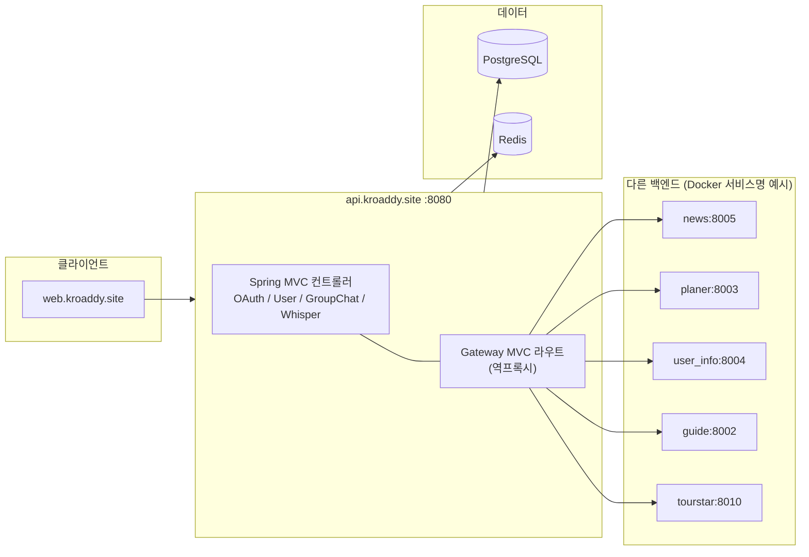

# api.kroaddy.site — API Gateway & 코어 백엔드

## 역할

단일 Spring Boot 애플리케이션으로 **BFF/API 게이트웨이**와 **도메인 API(인증·유저·그룹챗 등)**를 같은 JVM에서 실행합니다. 외부(프론트 `web.kroaddy.site`)는 기본적으로 **8080** 한 엔드포인트로 접속하고, 일부 경로는 **Spring Cloud Gateway MVC** 라우팅으로 다른 마이크로서비스(뉴스·플래너·프로필 등)로 프록시됩니다.

## 기술 스택

| 구분 | 선택 |
|------|------|
| 언어 / 런타임 | Java 21 (Gradle toolchain) |
| 프레임워크 | Spring Boot 3.5.8 |
| 클라우드 | Spring Cloud BOM 2025.0.0 (`spring-cloud-starter-gateway-server-webmvc`) — **서블릿 기반** 게이트웨이 |
| 보안 | Spring Security, OAuth2 Client(설정은 수동 OAuth 위주), JWT (jjwt 0.12.x) |
| 데이터 | Spring Data JPA, Hibernate, **PostgreSQL**, QueryDSL (Jakarta) |
| 캐시/세션 | Spring Data Redis (`UPSTASH_REDIS_*` 또는 호스트/포트) |
| HTTP 클라이언트 | Apache HttpClient 5 (PATCH 등) |
| API 문서 | SpringDoc OpenAPI (`/docs`, `/v3/api-docs`) |
| 빌드 | Gradle (`:gateway` 단일 모듈), Docker 멀티스테이지 빌드 |

루트 `settings.gradle`은 `gateway`만 포함합니다. 비즈니스 코드는 **`gateway/src/main/java/site/aiion/api/services`** 아래 패키지로 구성됩니다(별도 Gradle 서브모듈 분리 없음).

## 프로세스 구조

## 게이트웨이 라우팅 (요약)

`gateway/src/main/resources/application.yaml`의 `spring.cloud.gateway.server.webmvc.routes` 기준:

| Route ID | 대상 URI (환경변수로 오버라이드) | Path 조건 |
|----------|----------------------------------|-----------|
| `news` | `AI_SERVICE_NEWS_URL` → 기본 `http://news:8005` | `/api/v1/news`, `/api/v1/news/**` |
| `guide-public` | Guide | `/guide`, `/guide/**` (경로 rewrite) |
| `guide` | Guide | `/api/v1/festivals`, `/api/v1/festivals/**` |
| `planer` | `AI_SERVICE_TOURPLANER_URL` → `http://planer:8003` | `/api/v1/planner/**`, `/api/v1/user-content/**`, `/api/v1/k-content/**`, `/api/v1/weather`, `/api/v1/weather/**`, `/api/v1/maps/**` |
| `user-info` | `AI_SERVICE_USER_INFO_URL` → `http://user_info:8004` | `/api/v1/user-profile`, `/api/v1/user-profile/**` |
| `tourstar` | `AI_SERVICE_TOURSTAR_URL` → `http://tourstar:8010` | 사진 선택 등 |
| `tourstar-static` | 동일 | `/api/tourstar-files/**` → rewrite |

다운스트림 응답의 CORS 헤더는 게이트웨이 **글로벌 CORS**와 충돌하지 않도록 일부 라우트에서 제거합니다.

## 동일 애플리케이션 내 주요 도메인

- **`site.aiion.api.gateway`**: 애플리케이션 진입(`GatewayApplication`), 컴포넌트 스캔 루트.
- **`site.aiion.api.services.oauth`**: 소셜 로그인 콜백, JWT/리프레시 토큰, 쿠키, Redis 연동.
- **`site.aiion.api.services.user`**: 유저·친구·차단 등 JPA 엔티티 및 REST.
- **`site.aiion.api.services.groupchat`**: 그룹 채팅 관련 API·SSE 등.
- **`site.aiion.api.services.whisper`**: Whisper 관련 도메인.

`@EntityScan` / `@EnableJpaRepositories`는 `user`, `groupchat`, `whisper` 패키지를 포함합니다.

## 인프라·설정

- **포트**: `server.port` 기본 **8080**.
- **PostgreSQL**: `spring.datasource` — 기본 YAML에는 Hikari 풀 설정만 있고, **JDBC URL은 배포 환경에서 `SPRING_DATASOURCE_URL` 등 표준 속성**으로 주입하는 형태를 전제로 합니다. 로컬 프로파일 `application-local.yaml`에 예시 URL이 있습니다.
- **Redis**: 토큰/세션 등 — `UPSTASH_REDIS_URL` 또는 host/port/password, SSL 옵션.
- **JWT / OAuth**: `jwt.*`, `google.*`, `naver.*`, `kakao.*` 및 각종 `*_REDIRECT_URI`.
- **HTTP 타임아웃**: AI 백엔드 응답 지연에 맞춰 읽기 타임아웃 **180초** 등이 설정되어 있습니다.
- **가상 스레드**: `spring.threads.virtual.enabled: true`.

## 프론트와의 관계

CORS 허용 출처에 `https://web.kroaddy.site`, `http://localhost:3000`이 명시되어 있습니다. 브라우저는 **게이트웨이 도메인(예: api.kroaddy.site)** 으로 API를 호출하고, 위 Path 규칙에 따라 백엔드 마이크로서비스로 위임됩니다.

## 배포

- **Docker**: `gateway/Dockerfile` — Gradle로 `:gateway:build` 후 JRE 21 Alpine에서 `app.jar` 실행.
- **CI**: `.github/workflows/deploy-api-gateway.yml` — `main` 브랜치 푸시 시 Docker Hub에 `api.kroaddy.site` 이미지 빌드·푸시(EC2 등에서는 pull 후 직접 실행하는 흐름으로 주석 처리됨).

## 관련 레포지토리 경로

`backend/api.kroaddy.site/` — 루트에 `build.gradle`, `settings.gradle`, `gateway/` 모듈.
