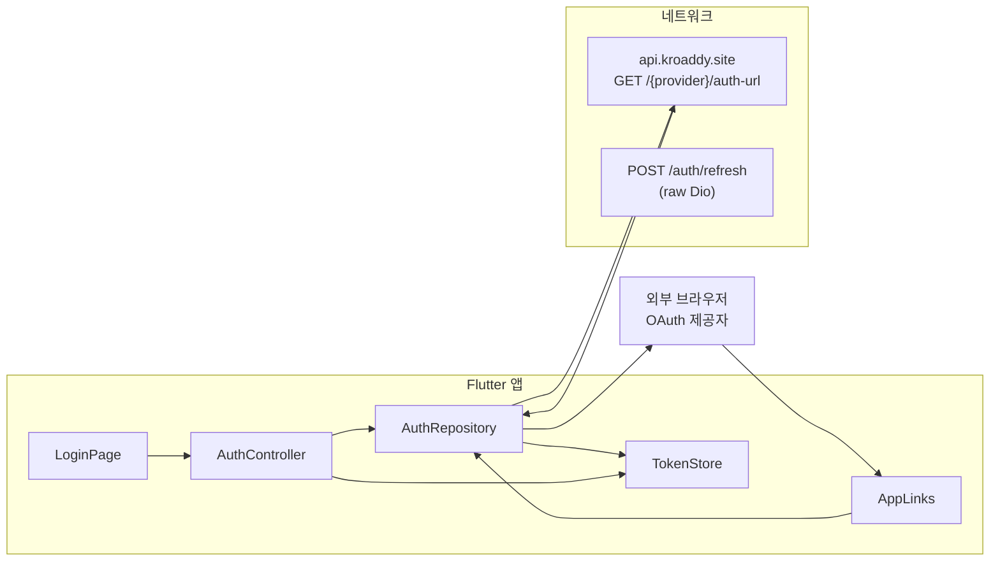
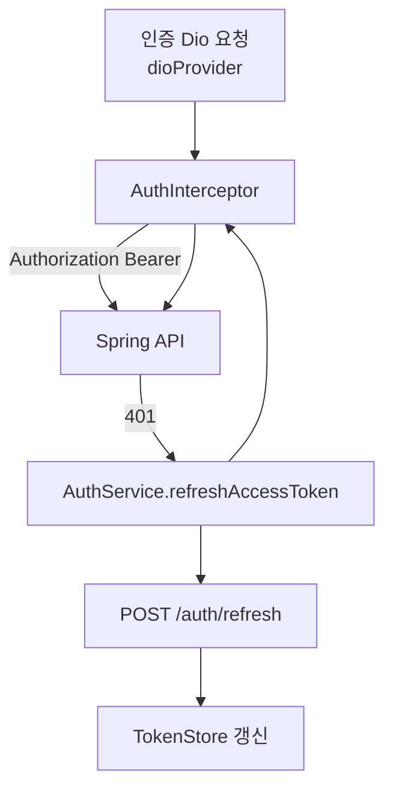

# Flutter — Auth (인증)

## 역할

카카오·네이버·Google OAuth 시작 URL을 게이트웨이에서 받아 **외부 브라우저**로 열고, 콜백 **`kroaddy://auth`** 딥링크로 전달된 JWT를 수신해 `flutter_secure_storage`에 저장합니다. API 호출용 Dio에는 `AuthInterceptor`가 붙어 Access Token을 헤더에 실으며, 만료 시 `/auth/refresh`로 갱신합니다.

## 사용 라이브러리 (`pubspec.yaml` 기준)

| 패키지 | 이 피처에서의 용도 |
|--------|-------------------|
| `flutter` / `cupertino_icons` | UI, 아이콘 |
| `flutter_riverpod` | `authControllerProvider`, DI |
| `go_router` | 로그인 성공 시 `/home` 이동 (`app_router`에서 `ref.listen`) |
| `dio` | `rawDio`(auth-url), 인증용 `dio`는 코어에서 조합 |
| `flutter_secure_storage` | Access/Refresh 토큰 영속 저장 (`TokenStore`) |
| `url_launcher` | OAuth 페이지를 **외부 브라우저**로 오픈 |
| `app_links` | `kroaddy://auth` 콜백 수신 (`getInitialLink` + `uriLinkStream`) |

## 서비스 흐름도

## 코드 위치

| 구분 | 경로 |
|------|------|
| UI | `lib/features/auth/presentation/login_page.dart` |
| 상태 | `lib/features/auth/presentation/state/auth_controller.dart`, `auth_state.dart` |
| 저장소 | `lib/features/auth/data/auth_repository.dart` |
| 토큰 | `lib/core/auth/token_store.dart`, `jwt_claims.dart` |
| 갱신 | `lib/core/auth/service/auth_service.dart` |
| 인터셉터 | `lib/core/network/auth_interceptor.dart` |

## Dio 사용

- `AuthRepository`는 **`rawDioProvider`** 사용 (아직 토큰 없이 `/…/auth-url` 호출).
- 로그인 이후 API는 **`dioProvider`** (인터셉터 포함).

## 주요 API (베이스: `API_BASE_URL`)

| 메서드 | 경로 | 용도 |
|--------|------|------|
| GET | `/{provider}/auth-url` | `provider`: kakao, naver, google. `frontend_url=kroaddy://auth` |
| POST | `/auth/refresh` | body: `refresh_token` (선택). 새 access/refresh 저장 |

## 딥링크

- 스킴: `kroaddy`, 호스트: `auth`
- 쿼리: `token`, `refresh_token`, `error`
- `app_links`로 `getInitialLink` + `uriLinkStream` 병행 (콜백 유실 방지)

## 관련 문서

- `md/flutter-kroaddy-app.md` — 전체 네트워크
- `md/기획서/login-system-reverse-planning.md` — 로그인 역기획(있는 경우)
