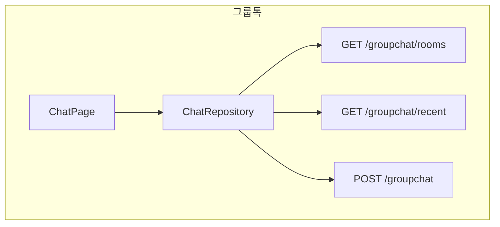
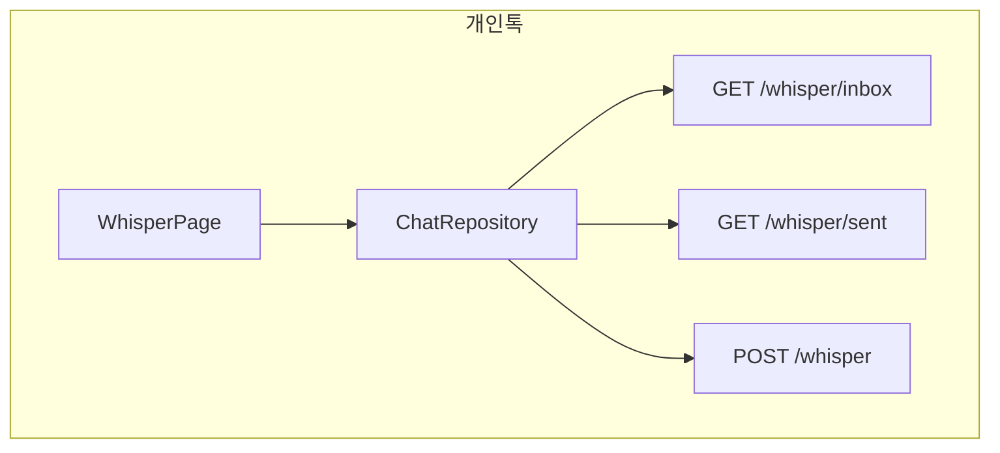
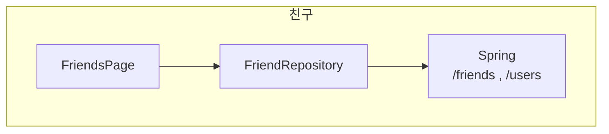

# Flutter — Chat (그룹톡·개인톡·친구)

## 역할

- **그룹톡**: 방(`roomType`)별 최근 메시지 조회, 메시지 전송 (`/groupchat`).
- **개인톡(Whisper)**: 받은편지함·보낸편지함, 1:1 전송 (`/whisper`).
- **친구**: 목록, 받은 요청, 요청/수락/삭제, 닉네임 검색 (`/friends`, `/users`).

모든 호출은 인증이 붙은 **`dioProvider`** 를 사용합니다.

## 사용 라이브러리 (`pubspec.yaml` 기준)

| 패키지 | 이 피처에서의 용도 |
|--------|-------------------|
| `flutter` | `ChatPage`, `WhisperPage`, `FriendsPage` UI |
| `flutter_riverpod` | `chatControllerProvider` |
| `go_router` | `/chat`, `/chat/friends`, `/chat/whisper` |
| `dio` | **`dioProvider`** — Spring MVC 그룹채팅·Whisper·친구·유저 검색 |

## 서비스 흐름도

## 코드 위치

| 구분 | 경로 |
|------|------|
| 그룹 UI | `lib/features/chat/presentation/chat_page.dart` |
| 개인톡 | `whisper_page.dart` |
| 친구 | `friends_page.dart` |
| 채팅 API | `lib/features/chat/data/chat_repository.dart` |
| 친구 API | `lib/features/chat/data/friend_repository.dart` |
| 모델 | `chat_models.dart` |
| 상태 | `presentation/state/chat_controller.dart`, `chat_state.dart` |

## 라우트

- `/chat`, `/chat/friends`, `/chat/whisper`

Drawer에서 `/chat/friends`, `/chat/whisper`는 그룹톡 활성 표시에서 제외(`excludePrefixes`).

## ChatRepository — 주요 API

| 메서드 | 경로 | 설명 |
|--------|------|------|
| GET | `/groupchat/rooms` | 응답 `code`, `data` |
| GET | `/groupchat/recent` | `roomType`, `limit` |
| POST | `/groupchat` | `roomType`, `message`, `lookingForBuddy` |
| GET | `/whisper/inbox` | |
| GET | `/whisper/sent` | |
| POST | `/whisper` | `toUserId`, `message` |

## FriendRepository — 주요 API

| 메서드 | 경로 |
|--------|------|
| GET | `/friends` |
| GET | `/friends/requests` |
| POST | `/friends/request` |
| POST | `/friends/accept` |
| DELETE | `/friends/{targetId}` |
| GET | `/users?nickname=` |

## 관련 문서

- `md/kroaddy-project-technical-spec.md` — Spring MVC 그룹채팅·유저 도메인
- `md/flutter-kroaddy-app.md`
