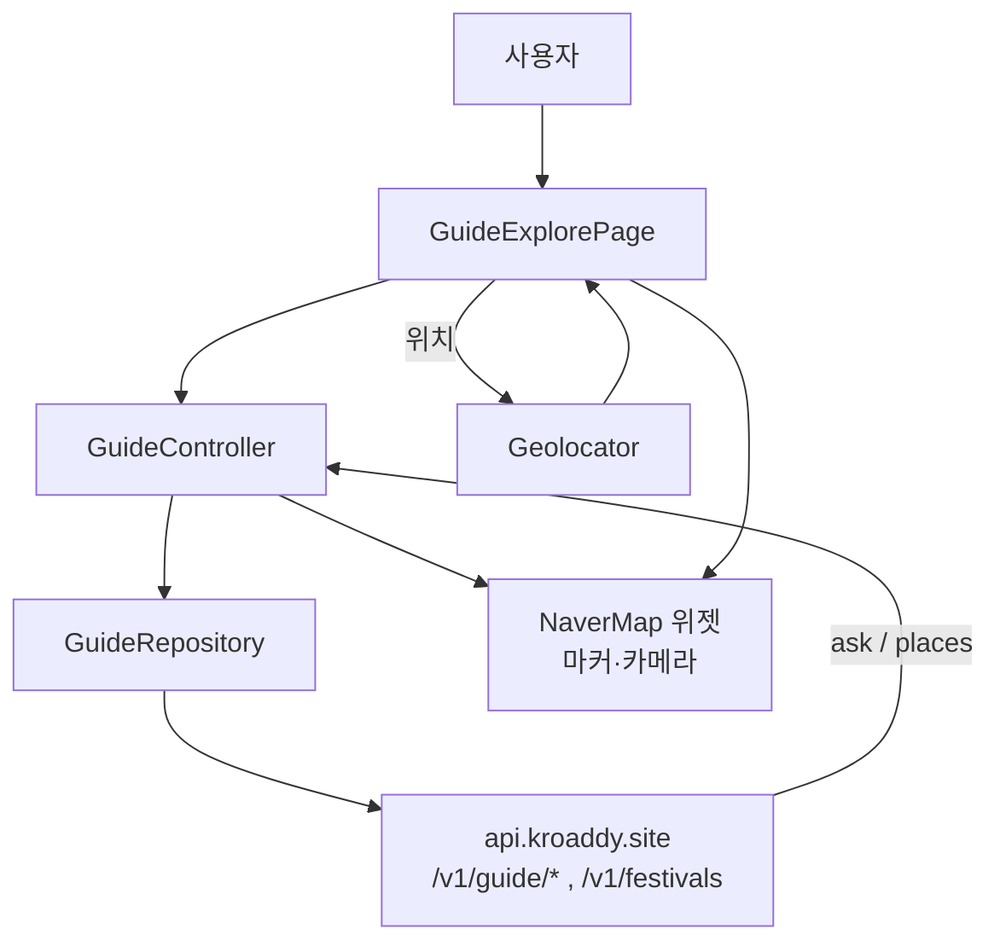
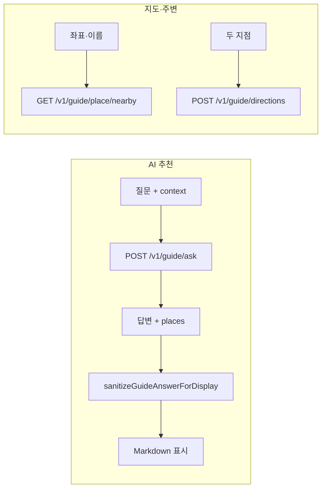

# Flutter — Guide (장소탐색)

## 역할

**AI에게 질문**해 장소 추천 답변과 **추천 지점 목록**을 받고, **flutter_naver_map**으로 마커·경로를 표시합니다. 카테고리(행사, K-액티비티, 역사/유적, 로컬문화, 자연/힐링, 맛집, 카페)에 맞는 프롬프트를 제공하고, **geolocator**로 현재 위치를 활용합니다. 행사 캘린더는 `fetchFestivals`로 월별 데이터를 조회합니다.

## 사용 라이브러리 (`pubspec.yaml` 기준)

| 패키지 | 이 피처에서의 용도 |
|--------|-------------------|
| `flutter` | `GuideExplorePage` 등 UI |
| `flutter_riverpod` | `guideControllerProvider` 등 |
| `go_router` | `/guide` 진입 |
| `dio` | `GuideRepository` → **`dioProvider`** (JWT·갱신) |
| `flutter_naver_map` | 추천 장소 마커·지도 뷰 (`main.dart`에서 SDK 초기화) |
| `geolocator` | 현재 위치 권한·좌표 |
| `flutter_markdown` | AI 답변 마크다운 렌더링 |

## 서비스 흐름도

## 코드 위치

| 구분 | 경로 |
|------|------|
| 메인 UI | `lib/features/guide/presentation/guide_explore_page.dart` |
| 보조 페이지 | `guide_landing_page.dart`, `guide_page.dart`, `event_page.dart`, `restaurant_page.dart` |
| Repository | `lib/features/guide/data/guide_repository.dart` |
| 모델·유틸 | `guide_models.dart`, `guide_map_utils.dart`, `guide_context.dart`, `guide_answer_sanitize.dart` |
| 상태 | `presentation/state/guide_controller.dart`, `guide_state.dart` |

## 라우트

- `/guide` — `GuideExplorePage`
- `/guide/event`, `/guide/restaurant` → `/guide` 리다이렉트

## 주요 API (인증 Dio, `dioProvider`)

베이스: `API_BASE_URL` (예: `.../api`)

| 메서드 | 경로 | 비고 |
|--------|------|------|
| GET | `/v1/festivals` | `year`, `month` |
| POST | `/v1/guide/ask` | 질문 + 선택적 `context`. receive timeout **120s** |
| POST | `/v1/guide/directions` | 출발/도착 좌표 |
| GET | `/v1/guide/place/details` | `name` |
| GET | `/v1/guide/place/nearby` | 좌표·이름·카테고리 |

답변 표시 전 `sanitizeGuideAnswerForDisplay`로 마크다운/표시용 정리.

## 외부 SDK

- **Naver Map Dynamic Map**: `main.dart`에서 `NAVER_MAP_DYNAMIC_MAP_CLIENT_ID` 로 초기화
- **Geolocator**: 위치 권한·현재 좌표

## 관련 문서

- `md/api-kroaddy-site.md` — `/guide` 게이트 경로
- `md/flutter-kroaddy-app.md`
