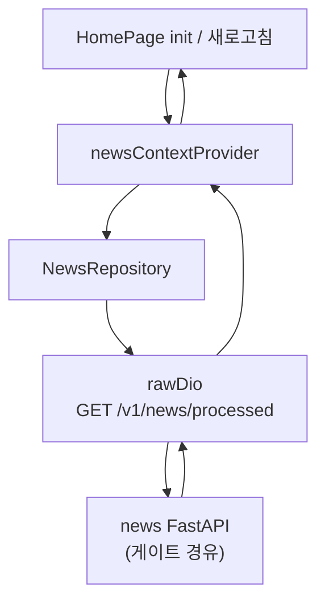
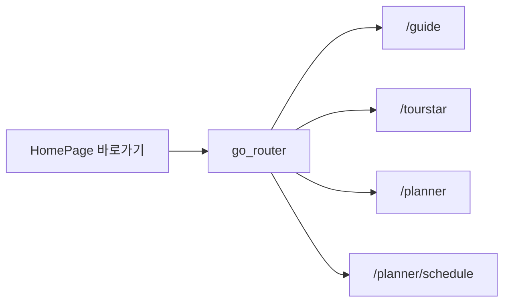

# Flutter — Home (홈)

## 역할

앱 진입 후 허브 화면으로, **AI 가공 뉴스 Top10** 캐러셀, **장소탐색·여행피드·여행플래너·마이플랜** 바로가기, **K-POP / K-DRAMA / K-FOOD / K-BEAUTY** 테마 타일, **시골 환급** 지역 안내 및 한국관광공사(Visit Korea) 링크 등을 제공합니다.

## 사용 라이브러리 (`pubspec.yaml` 기준)

| 패키지 | 이 피처에서의 용도 |
|--------|-------------------|
| `flutter` | `HomePage` UI, 스크롤·캐러셀 |
| `flutter_riverpod` | `newsContextProvider`, `ConsumerStatefulWidget` |
| `go_router` | 바로가기에서 `context.go("/guide")` 등 |
| `dio` | `NewsRepository` → **`rawDioProvider`** (인터셉터 없음) |
| `url_launcher` | Visit Korea 등 외부 HTTPS 링크 오픈 |

## 서비스 흐름도

## 코드 위치

| 구분 | 경로 |
|------|------|
| 페이지 | `lib/features/home/home_page.dart` |
| 뉴스 상태 | `lib/features/home/state/news_context.dart` |
| API | `lib/features/home/data/news_repository.dart` |

## 라우트

- `GoRoute path: /home` (`lib/core/router/app_router.dart`)

## 주요 API

`NewsRepository`는 **`rawDioProvider`** 를 사용합니다 (인터셉터 없음).

| 메서드 | 경로 (base + path) | 설명 |
|--------|-------------------|------|
| GET | `/v1/news/processed` | `limit_rest` 쿼리. 응답 `top10` 배열 |

최종 URL 예: `https://api.kroaddy.site/api/v1/news/processed`

## 외부 링크

- `url_launcher`로 Visit Korea 등 공개 URL 연결 (코드 내 상수 참고).

## 관련 문서

- `md/news-kroaddy-site.md` — 뉴스 백엔드(있는 경우)
- `md/flutter-kroaddy-app.md`
