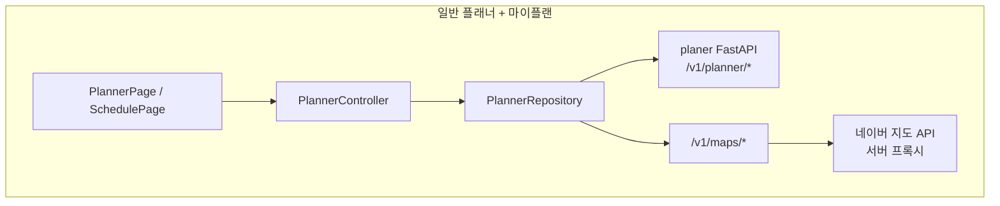
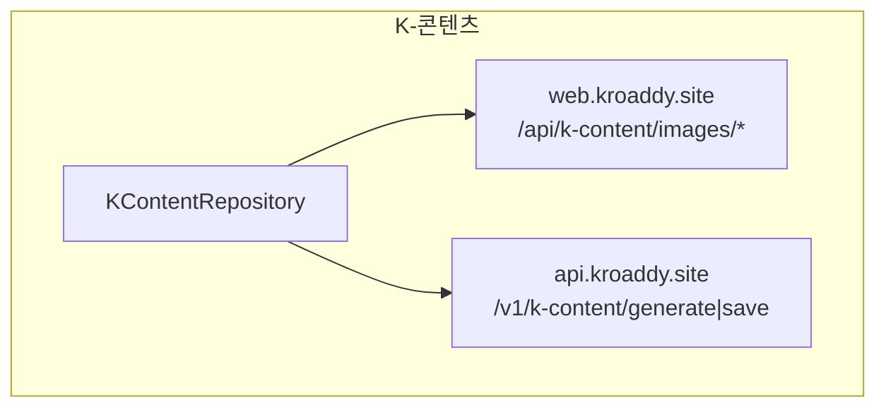
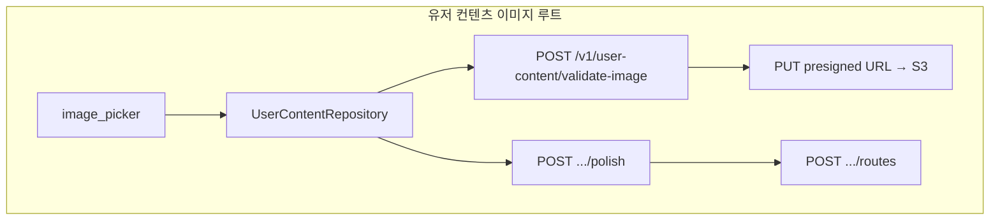

# Flutter — Planner (여행플래너·K-콘텐츠·마이플랜)

## 역할

- **지역(slug) 기반 여행지 탐색** 및 **AI 루트·일정 생성** (`/v1/planner/...`).
- **플랜 저장·조회·삭제·AI 수정·아이템 리롤** 등 마이플랜(`SchedulePage`)과 연동.
- **K-콘텐츠 패키지**: 웹 Next API에서 이미지 목록을 가져오고, `generate`·`save`로 일정 생성·저장.
- **유저 컨텐츠**: 이미지 업로드(NSFW 검증·presigned S3)·`polish`·루트 CRUD.
- **지도**: 백엔드 `/v1/maps` 프록시로 static map, 장소 검색, 네이버 Directions 5 (자동차 경로) — 웹 `NaverRouteMapModal`과 동일 계약 주석 참고.

## 사용 라이브러리 (`pubspec.yaml` 기준)

| 패키지 | 이 피처에서의 용도 |
|--------|-------------------|
| `flutter` | `PlannerPage`, `SchedulePage`, `KContentPackagePage` UI |
| `flutter_riverpod` | `plannerControllerProvider`, `userContentControllerProvider`, `kContentControllerProvider` |
| `go_router` | `/planner`, `/planner/k-content`, `/planner/schedule` 등 |
| `dio` | 세 Repository 모두 **`dioProvider`** (플랜 AI는 timeout 180s); S3 presigned 업로드만 별도 `Dio()` |
| `image_picker` | 유저 컨텐츠 루트용 사진 선택 (`UserContentRepository` / 컨트롤러) |

## 서비스 흐름도

## 코드 위치

| 구분 | 경로 |
|------|------|
| 플래너 UI | `lib/features/planner/presentation/planner_page.dart` |
| 마이플랜 | `schedule_page.dart` |
| K-콘텐츠 상세 | `k_content_package_page.dart` |
| Repository | `planner_repository.dart`, `k_content_repository.dart`, `user_content_repository.dart` |
| 모델 | `planner_models.dart`, `user_content_models.dart` |
| 상태 | `state/planner_controller.dart`, `user_content_controller.dart`, `k_content_controller.dart` 및 각 `*_state.dart` |

## 라우트

- `/planner`, `/planner/k-content`, `/planner/k-content/:packageId`, `/planner/schedule`

## PlannerRepository — 주요 API

AI 호출은 receive timeout **180초**, send **60초** (`_plannerAiOptions`).

| 메서드 | 경로 | 설명 |
|--------|------|------|
| POST | `/v1/planner/{location}/routes` | 루트 후보. `news_top10`, `transport_mode` 등 |
| POST | `/v1/planner/{location}/schedule` | 선택 루트 기준 일정 |
| POST | `/v1/planner/plans` | 일정 저장 |
| GET | `/v1/planner/plans` | `user_id` — 내 플랜 목록 |
| DELETE | `/v1/planner/plans/{planId}` | |
| PATCH | `/v1/planner/plans/{planId}/modify` | AI 수정 (장시간) |
| POST | `/v1/planner/plans/{planId}/items/reroll` | 일정 아이템 AI 리롤 (장시간) |
| GET | `/v1/maps/static-map` | 바이너리 이미지 |
| GET | `/v1/maps/place-search` | 장소명 검색 |
| POST | `/v1/maps/directions` | 경로 polyline 요약 |

## KContentRepository

| 호출 대상 | 경로 | 설명 |
|-----------|------|------|
| **WEB_BASE_URL** | GET `/api/k-content/images/banner` | 배너 이미지 URL 목록 |
| **WEB_BASE_URL** | GET `/api/k-content/images/{packageId}` | 패키지별 이미지 |
| **API_BASE_URL** | POST `/v1/k-content/generate` | 일정 생성 (장시간) |
| **API_BASE_URL** | POST `/v1/k-content/save` | 플랜 저장 |
| **API_BASE_URL** | GET `/v1/k-content/health` | 헬스 |

## UserContentRepository

| 메서드 | 경로 |
|--------|------|
| POST | `/v1/user-content/validate-image` | multipart 업로드 → 검증·presigned URL |
| PUT | (presigned URL) | S3 직접 업로드 (별도 `Dio` 인스턴스) |
| GET | `/v1/user-content/routes` |
| POST | `/v1/user-content/routes/polish` |
| POST | `/v1/user-content/routes` | 저장 |
| POST | `/v1/user-content/routes/{id}/like` |

## 관련 문서

- `md/planer-kroaddy-site.md`
- `md/flutter-kroaddy-app.md`
