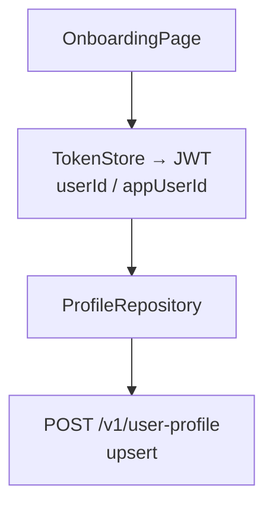
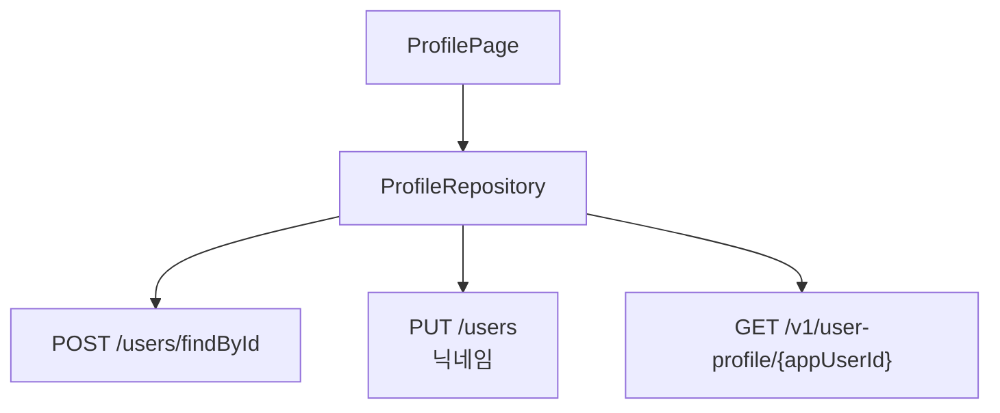
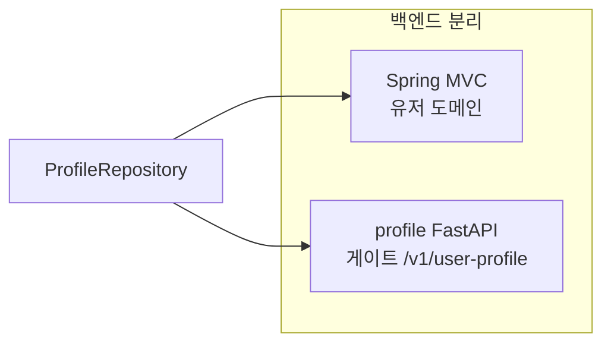

# Flutter — Profile (프로필·온보딩)

## 역할

- **설정/프로필 화면**: 닉네임 변경, 회원 조회, (옵션) 탈퇴 등 Spring 유저 API 연동.
- **여행 프로필**: FastAPI `profile` 서비스 게이트 경로 `/v1/user-profile` 로 조회·저장(upsert).
- **온보딩**: 국적·성별·나이대·식습관·종교 등 단계별 `ChoiceChip` 입력 후 `upsertTravelProfile`.

JWT에서 `userId`·`appUserId`를 파싱해 프로필 API의 `user_id`와 매핑합니다.

## 사용 라이브러리 (`pubspec.yaml` 기준)

| 패키지 | 이 피처에서의 용도 |
|--------|-------------------|
| `flutter` | `ProfilePage`, `OnboardingPage`, `ChoiceChip` 폼 |
| `flutter_riverpod` | `profileControllerProvider` 등 |
| `go_router` | `/profile`, `/profile/onboarding` |
| `dio` | **`dioProvider`** — `/users`, `/v1/user-profile` |
| `flutter_secure_storage` | (간접) `TokenStore`에서 Access Token 읽어 JWT 클레임 파싱 |

## 서비스 흐름도

## 코드 위치

| 구분 | 경로 |
|------|------|
| 프로필 UI | `lib/features/profile/presentation/profile_page.dart` |
| 온보딩 | `onboarding_page.dart` |
| Repository | `lib/features/profile/data/profile_repository.dart` |
| 모델 | `profile_models.dart` |
| 상태 | `presentation/state/profile_controller.dart`, `profile_state.dart` |
| JWT | `lib/core/auth/jwt_claims.dart` |

## 라우트

- `/profile`, `/profile/onboarding`

## ProfileRepository — 주요 API

| 메서드 | 경로 | 설명 |
|--------|------|------|
| POST | `/users/findById` | body `id` |
| PUT | `/users` | 닉네임 등 전체 페이로드 |
| DELETE | `/users` | body `id` |
| GET | `/v1/user-profile/{appUserId}` | 404 → null |
| POST | `/v1/user-profile` | upsert (`user_id`, 성별, 나이대, 식습관, 종교, 국적 등) |

## 관련 문서

- `md/profile-kroaddy-site.md`
- `md/flutter-kroaddy-auth.md` — 토큰·ID 클레임
- `md/flutter-kroaddy-app.md`
