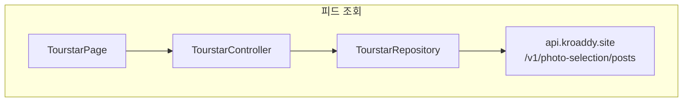
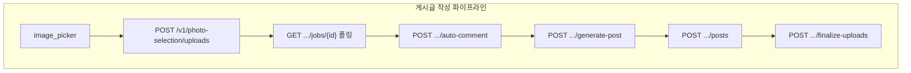
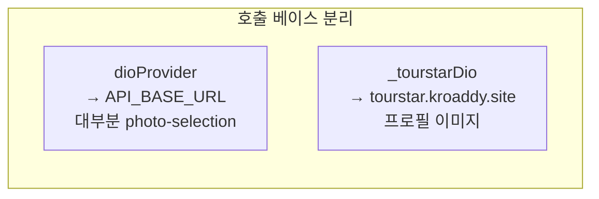

# Flutter — Tourstar (여행피드)

## 역할

여행 **사진 업로드·선별 작업(job)·자동 코멘트·게시글 생성**부터 **피드 목록·상세·작성·수정·삭제**까지 담당합니다. 이미지 URL은 게이트웨이의 `/tourstar-files/...` 형태로 정규화하는 헬퍼(`toDisplayImageUrl`)가 있습니다. **프로필 이미지 등 일부 요청**은 `https://tourstar.kroaddy.site` 를 base로 하는 별도 `Dio`(`_tourstarDio`)로 호출합니다.

## 사용 라이브러리 (`pubspec.yaml` 기준)

| 패키지 | 이 피처에서의 용도 |
|--------|-------------------|
| `flutter` | `TourstarPage` UI (피드·작성·필터) |
| `flutter_riverpod` | `tourstarControllerProvider` |
| `go_router` | `/tourstar`, `/tourstar/post/:postId`, query `postId` |
| `dio` | 게이트 **`dioProvider`** + Tourstar 전용 **`_tourstarDio`** (이중 베이스 URL) |
| `image_picker` | 갤러리/카메라에서 사진 선택 |
| `exif` | 이미지 메타데이터 활용(컨트롤러) |
| `share_plus` | 게시글/링크 공유 |

## 서비스 흐름도

## 코드 위치

| 구분 | 경로 |
|------|------|
| UI | `lib/features/tourstar/presentation/tourstar_page.dart` |
| 상태 | `presentation/state/tourstar_controller.dart`, `tourstar_state.dart` |
| Repository | `lib/features/tourstar/data/tourstar_repository.dart` |
| 모델 | `tourstar_models.dart` |
| 공유 파서 | `lib/core/utils/tourstar_share_parser.dart` |

## 라우트

- `/tourstar`, `/tourstar/post/:postId`, query `postId` 지원 (딥링크)

## 주요 API (대부분 `dioProvider`, 베이스 `API_BASE_URL`)

| 메서드 | 경로 | 비고 |
|--------|------|------|
| POST | `/v1/photo-selection/uploads` | multipart `files`, 장시간 timeout |
| GET | `/v1/photo-selection/jobs/{jobId}` | |
| POST | `/v1/photo-selection/auto-comment` | |
| POST | `/v1/photo-selection/generate-post` | |
| GET | `/v1/photo-selection/posts` | 목록 |
| GET | `/v1/photo-selection/posts/{postId}` | 상세 |
| POST | `/v1/photo-selection/posts` | 생성 |
| PATCH / POST | `/v1/photo-selection/posts/{postId}` 또는 `.../update` | 수정 (405 시 폴백) |
| DELETE / POST | `.../delete` | 삭제 (405 시 폴백) |
| POST | `/v1/photo-selection/finalize-uploads` | 임시 경로 → S3 URL |
| POST | `/v1/photo-selection/posts/{postId}/comments` | 댓글 |
| POST | `/v1/photo-selection/posts/{postId}/honor/vote` | 명예 투표 |
| GET | `/v1/photo-selection/posts/{postId}/share-preview` | 공유 미리보기 |

웹 공유 링크: `https://web.kroaddy.site/tourstar?postId=...` (`buildShareUrl`)

## 별도 Base URL (`_tourstarDio`)

`_kTourstarBaseUrl = https://tourstar.kroaddy.site` — 프로필 이미지 전용. 경로에 **`/api` prefix** 포함.

| 메서드 | 경로 | 설명 |
|--------|------|------|
| GET | `/api/v1/photo-selection/profile-image` | `user_id` |
| POST | `/api/v1/photo-selection/upload-profile-image` | multipart `file`, 선택 `user_id` |

## 클라이언트

- **image_picker**: 갤러리/카메라
- **share_plus**: 공유(환경에 따라 사용)

## 관련 문서

- `md/kroaddy-project-technical-spec.md` — tourstar FastAPI·비전 스택
- `md/flutter-kroaddy-app.md`
