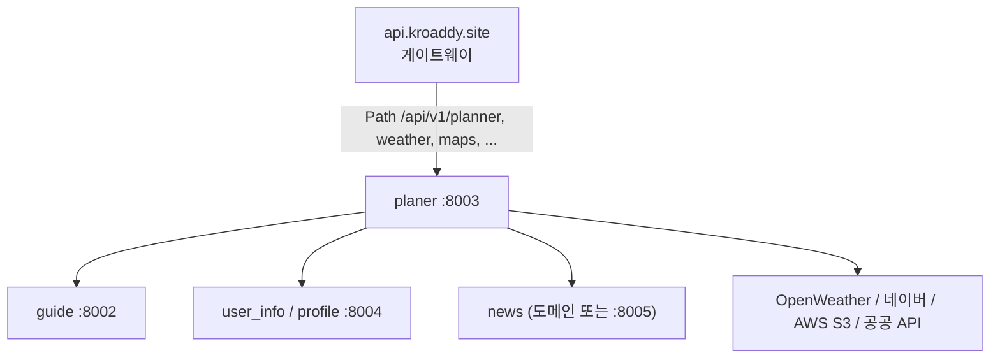

# planer.kroaddy.site — AI 여행 플래너 (Tour Planner)

## 역할

**LangGraph / LangChain** 기반으로 여행 **루트·일정 추천**, **K-콘텐츠**, **유저 컨텐츠(이미지 업로드·AI 폴리시)**, **날씨**, **지도(네이버 등)** 기능을 제공하는 FastAPI 백엔드입니다. 긴 AI 응답 시간을 고려해 게이트웨이 **읽기 타임아웃 180초**와 맞춰져 있습니다.

## 기술 스택

| 구분 | 선택 |
|------|------|
| 언어 | Python 3.11 |
| 웹 | FastAPI, Uvicorn (프로덕션 CMD에서 workers 4, keep-alive 180초) |
| AI 오케스트레이션 | LangGraph, LangChain Core |
| LLM | Google Gemini (`langchain-google-genai`), OpenAI (`langchain-openai`) 폴백 |
| 브라우저 자동화 | Playwright + Chromium (네이버 플레이스 영업시간 등) |
| 이미지 안전 | NudeNet + ONNX Runtime, Pillow |
| DB | SQLAlchemy asyncio, asyncpg/psycopg2, **Alembic** (시작 시 `alembic upgrade head`) |
| 스토리지 | AWS S3 (boto3, presigned URL) |
| 기타 | httpx, python-multipart |

## 런타임·포트

- 기본 포트 **8003** (`PORT`).
- `Dockerfile`: Debian slim, `libgomp1`(ONNX), Playwright Chromium 설치, NudeNet 모델 프리로드 시도, 시작 시 **마이그레이션 후** Uvicorn.

## API 모듈 구성 (`app/api/v1/`)

| 라우터 | prefix | 내용 |
|--------|--------|------|
| `standard/routes.py` | `/api/v1/planner` | LangGraph 루트/일정, 캐시·플랜 저장 등 |
| `k_content/routes.py` | `/api/v1/k-content` | K-콘텐츠 관련 |
| `user_content/routes.py` | `/api/v1/user-content` | 업로드·NSFW 검사·S3 presigned·루트 CRUD |
| `routes_weather.py` | `/api/v1/weather` | OpenWeatherMap 등 날씨 프록시/가공 |
| `routes_maps.py` | `/api/v1/maps` | 네이버 맵 API 래핑 |

`app/main.py`에서 `v1_router`로 일괄 마운트합니다.

## 에이전트·서비스 레이어

- **`app/agent/standard/`**: LangGraph 그래프(`routes_graph`, `schedule_graph` 등), 노드 로직.
- **`app/services/`**: `weather_client`, `naver_place_hours`, `festival_client`, `news_client`, `user_info_client` 등 — **다른 내부/외부 HTTP API**를 조합.

## 설정 (`app/core/config.py`) 요약

환경변수·`.env`로 로드되는 주요 항목:

- `GEMINI_API_KEY`, `OPENAI_API_KEY`, `DATABASE_URL`
- **내부 MSA**: `guide_service_url` / `festival_service_url`(기본 8002), `user_info_service_url`(기본 8004)
- **뉴스**: `news_service_url` (예: `https://news.kroaddy.site`)
- **공공/외부**: `data_go_kr_service_key`, `kobis_api_key`
- **AWS**: 액세스 키, 리전, 버킷, `s3_public_base_url`
- **네이버**: Maps, Search, (옵션) 플레이스 영업시간 Playwright

## 다른 서버와의 연결

| 대상 | 용도 |
|------|------|
| **api.kroaddy.site** | `planer` 라우트로 `/api/v1/planner/**`, `/api/v1/user-content/**`, `/api/v1/k-content/**`, `/api/v1/weather`, `/api/v1/maps/**` 역프록시 (`AI_SERVICE_TOURPLANER_URL`). |
| **guide** (8002) | 축제·가이드 데이터 연동 (`festival_client` 등). |
| **user_info / profile** (8004) | `fetch_user_profile` 등으로 여행자 프로필 조회. |
| **news** | Top 뉴스 등 (`news_client`, URL은 설정으로 외부 HTTPS 가능). |
| **외부** | 날씨, 네이버 지도/검색, S3, KOBIS, 공공데이터포털 등 |

## 배포

- **CI**: `.github/workflows/deploy-planer.yml` — Docker Hub `planer.kroaddy.site` 이미지.
- **Docker**: 의존성·Playwright·NudeNet까지 포함해 이미지 크기가 큼; CPU 추론용 `onnxruntime` 명시.

## 관련 레포지토리 경로

`backend/planer.kroaddy.site/`
