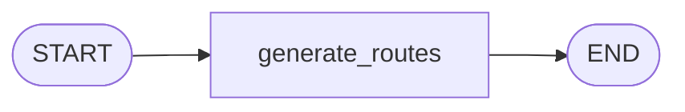
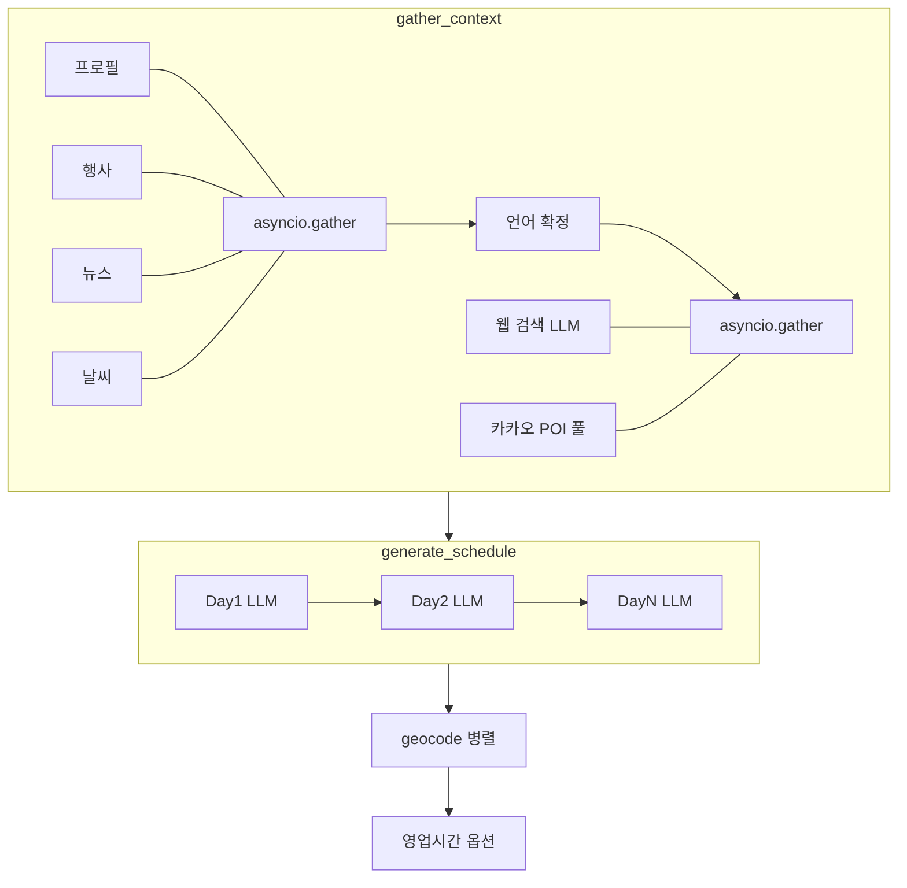

# Standard 플래너 아키텍처 (LangGraph)

`backend/planer.kroaddy.site/app/agent/standard/` 기준. **루트 추천**과 **일정 생성** 두 개의 컴파일된 그래프가 있으며, 상태는 공통 `PlannerState`(TypedDict)를 사용한다.

---

## 1. 파일 구성

| 파일 | 역할 |
|------|------|
| `graph.py` | `routes_graph`, `schedule_graph` 빌드·export |
| `state.py` | `PlannerState` — 요청 파라미터·수집 컨텍스트·생성 결과 |
| `nodes_routes.py` | `generate_routes` — 7테마 루트 단일 노드 |
| `nodes_schedule.py` | 컨텍스트 수집·일차 생성·지오코딩·영업시간 등 일정 파이프라인 |
| `nodes_common.py` | Gemini 호출·언어 매핑·`modify_schedule` / `reroll_single_item` 등 공통 헬퍼 |

**참고:** HTTP API의 **L1 메모리·L2 Neon DB 일정/루트 캐시**는 `app/api/v1/standard/routes.py`에 있으며, LangGraph 패키지 밖에서 그래프 전후를 감싼다.

---

## 2. 상태: `PlannerState`

### 요청·옵션

- `location`, `location_name`, `user_id`, `route_name`, `start_date`, `end_date`
- `transport_mode` (`car` | `transit` | `walk`)
- `use_search` — True일 때 gather에서 Gemini+Google Search로 웹 맥락 수집

### `gather_context` 이후 채워지는 필드

| 필드 | 출처 |
|------|------|
| `user_profile` | user_info(프로필) |
| `festivals` | 가이드/DB 캐시 기반 행사 |
| `news_top10` | 뉴스 서비스 또는 요청에 실린 목록 |
| `weather_forecast` | OpenWeatherMap 경로 |
| `web_search_context` | `_gather_web_search_context` (선택) |
| `web_search_gather_attempted` | 웹 수집 시도 여부 |
| `kakao_poi_context_block` | 카카오 키워드(명소·맛집·카페) POI 풀 텍스트 |

### 생성 결과

- `routes`, `schedule`, `cost_summary`, `error`
- `existing_routes` — 루트 그래프 전용(중복 제외)

---

## 3. 그래프 A: 루트 (`routes_graph`)

단일 LLM 노드만 사용한다. 행사/뉴스/날씨는 **호출하지 않는다** (일정 단계에서 반영).

| 노드 | 설명 |
|------|------|
| **generate_routes** | Gemini로 7개 테마별 루트 JSON (`name`, `theme`, `description`, `highlights`). `existing_routes` 있으면 프롬프트에 제외 블록 삽입. |

---

## 4. 그래프 B: 일정 (`schedule_graph`)

선형 파이프라인. **일차별 LLM은 순차**이며, **지오코딩은 항목 전체 병렬**이다.

### 4.1 `gather_context` (`gather_context_node`)

1. **1차 `asyncio.gather` (4-way)**  
   - 프로필(`user_info`)  
   - 행사(DB 캐시 포함 `fetch_festivals_for_period_with_db_cache`)  
   - 뉴스(`fetch_news_top10` 또는 state에 이미 있는 목록)  
   - 날씨(`fetch_weather_for_planner`)

2. **언어 확정** — `_get_lang(profile)`

3. **2차 `asyncio.gather` (2-way, `return_exceptions=True`)**  
   - **웹:** `use_search`이면 `_gather_web_search_context` (Gemini + Google Search, 타임아웃·길이 제한), 아니면 빈 문자열  
   - **카카오 POI:** `_gather_kakao_poi_pool_block` — `명소` / `맛집` / `카페` 각 키워드로 `kakao_keyword_search_many`를 내부에서 병렬 호출 후, 중복 제거·문자 상한으로 프롬프트 블록 생성. **`UPSTASH_REDIS_REST_URL` / `UPSTASH_REDIS_REST_TOKEN`** 이 있으면 동일 지역·언어에 대해 **L0(Upstash REST)** 에 완성 블록을 캐시(`redis_cache_ttl_poi_sec`, 기본 3600초)해 카카오 호출을 줄인다.

→ state에 `user_profile`, `festivals`, `news_top10`, `weather_forecast`, `web_search_context`, `kakao_poi_context_block` 등 반환.

### 4.2 `generate_schedule`

- **날짜 있음 (`_build_date_list` 비음):**  
  - `common_kwargs`에 웹 블록 + **카카오 POI 블록** + 뉴스·날씨·행사·프로필 등을 넣고, **일차마다 `await _generate_single_day`** (순차).  
  - 이전 일차 `place` / `place_ko` / `_venue_dedupe_key`를 `exclude_places`로 누적.  
  - 전체 검사 후 `_fix_duplicate_days`로 중복 일차 보정 가능.

- **날짜 없음:** 단일 대형 프롬프트로 N일 JSON 한 번 생성(폴백 경로).

내부 헬퍼(노드는 아님): `_validate_full_trip_schedule`, `_venue_dedupe_key`, `_generate_single_day`, `_fix_duplicate_days`, `_fix_failed_places` 등.

### 4.3 `geocode_schedule`

1. 모든 일정 항목에 대해 **`asyncio.gather` + `_geocode_item`** (병렬)  
   - 1순위: 카카오 키워드(`region` 힌트)  
   - 2순위: 네이버 Geocoding(주소형 보조)

2. `geocode_failed` 항목에 대해 **`_fix_failed_places`** (LLM 대체 + 재지오코딩, 제한적)

3. 일차별 `_optimize_day_order`(time 슬롯 순)·`_validate_day_items` 로깅

### 4.4 `enrich_business_hours`

`settings.naver_place_hours_enabled`일 때만 네이버 플레이스 기반 영업시간 보강. 실패 시 state 그대로.

---

## 5. LLM·외부 서비스 요약

| 구분 | 용도 |
|------|------|
| **Gemini** (`nodes_common._invoke`) | 루트 생성, 일차 JSON, 웹 맥락 수집(검색 도구), 실패 장소 대체 등 |
| **Google Search** | `use_search` 시 웹 맥락 전용(일차 생성 루프에서는 일반 Gemini) |
| **카카오 로컬** | POI 풀 + 지오코딩 1순위 |
| **네이버 Maps** | 지오코딩 2순위, (옵션) 영업시간 |
| **OpenWeatherMap** | 날씨 블록 |
| **user_info / guide / news** | 프로필·행사·뉴스 |
| **Upstash Redis REST** (선택) | `app/services/upstash_redis.py` — 카카오 POI 풀 문자열 L0 캐시 등 |

---

## 6. 스트리밍 API (`routes.py`)

`POST .../schedule/stream`은 **동일 `gather_context_node`** 결과를 사용해 SSE로 일차별 진행을 보낸다. `common_kwargs`에 `web_search_block`과 **`poi_context_block`**을 넣어 비스트리밍 일정과 같은 프롬프트 구성을 맞춘다.

- 첫 실작업 이벤트 **`run`**: `thread_id`(요청에 `ScheduleRequest.thread_id`가 없으면 서버가 임의 발급), `langgraph_checkpoint`(``LANGGRAPH_REDIS_URL`` 설정 시 true). 클라이언트는 **동일 `thread_id`**로 재연결 시 gather 단계를 생략하고 Upstash에 저장된 수집 맥락을 복원할 수 있다(``UPSTASH_REDIS_REST_*`` + `redis_stream_gather_ttl_sec`). 완료 시 gather 스냅샷은 삭제된다.
- **`POST .../schedule`**(비스트리밍)은 `LANGGRAPH_REDIS_URL`이 유효하면 `langgraph-checkpoint-redis`의 **AsyncRedisSaver**로 컴파일된 그래프에 `thread_id`를 넘겨 노드 단위 체크포인트를 남긴다. 응답 JSON에 `thread_id`가 포함되며, **재시도 시 동일 값**을 내면 마지막 체크포인트부터 이어간다. (공식 Redis 체크포인터는 RedisJSON·RediSearch 등이 필요해 Upstash에서 `asetup()`이 실패하면 자동으로 무체크포인트 그래프로 폴백한다.)

---

## 7. 다이어그램: 일정 데이터 흐름(요약)

---

*문서는 코드 변경에 맞춰 갱신할 것. 상세 API·캐시 키는 `md/planer-kroaddy-site.md` 및 `routes.py`를 참고.*
